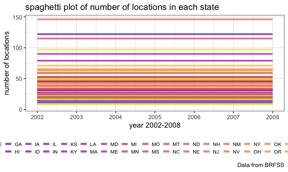
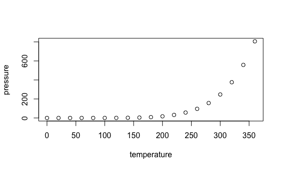

p8105\_hw3\_cz2544
================
Chunxiao Zhai
10/12/2018

Problem 1
=========

*1. data cleaning* format the data to use appropriate variable names; focus on the “Overall Health” topic include only responses from “Excellent” to “Poor” organize responses as a factor taking levels ordered from “Excellent” to “Poor”

``` r
brfss_tidy = brfss_smart2010 %>% 
  janitor::clean_names() %>% 
  select(year, locationabbr, locationdesc, topic, response, data_value, geo_location) %>% 
  filter(topic == "Overall Health") %>% 
  mutate(perctage = data_value, response = factor(response, levels = c("Excellent","Very good","Good","Fair","Poor" )))
```

*2. Using this dataset, do or answer the following (commenting on the results of each): In 2002, which states were observed at 7 locations?*

``` r
brfss_tidy %>% 
  filter(year == 2002) %>% 
  group_by(locationabbr) %>% 
  distinct(geo_location) %>%
  filter(n() == 7) %>% 
  summarise()
```

    ## # A tibble: 3 x 1
    ##   locationabbr
    ##   <chr>       
    ## 1 CT          
    ## 2 FL          
    ## 3 NC

Comment: In 2002, there were three states observed at 7 locations: Connecticut, Florida and North Carolina.

*Make a “spaghetti plot” that shows the number of locations in each state from 2002 to 2010.*

``` r
p1 = brfss_tidy %>%
  group_by(locationabbr) %>% 
  mutate(n = n_distinct(geo_location, year)) %>% 
  distinct(year, locationabbr, n) %>% 
  ggplot(aes(x = year, y = n, color = locationabbr)) +
  geom_line(alpha = 0.7, size = 1.2) + 
  labs(
    title = "spaghetti plot of number of locations in each state",
    x = "year 2002-2008",
    y = "number of locations",
    caption = "Data from BRFSS"
  ) + 
  scale_x_continuous(breaks = c(2002,2003,2004,2005,2006,2007,2008),
                     limits = c(2002, 2008)) +
  viridis::scale_color_viridis(option="plasma", name = "States", discrete = TRUE) +
  theme(legend.direction = "horizontal", legend.key.size = unit(0.4, "cm"),
        legend.text = element_text(size = 7.5),
        legend.title = element_text(size = 8))
p1 + guides(col = guide_legend(ncol = 26, nrow = 2, override.aes = list(size = 1.5)))
```

    ## Warning: Removed 99 rows containing missing values (geom_path).



Make a table showing, for the years 2002, 2006, and 2010, the mean and standard deviation of the proportion of “Excellent” responses across locations in NY State.

For each year and state, compute the average proportion in each response category (taking the average across locations in a state). Make a five-panel plot that shows, for each response category separately, the distribution of these state-level averages over time.

Problem 2
=========

``` r
data(instacart)
```

The goal is to do some exploration of this dataset. To that end, write a short description of the dataset, noting the size and structure of the data, describing some key variables, and giving illstrative examples of observations. Then, do or answer the following (commenting on the results of each):

How many aisles are there, and which aisles are the most items ordered from? Make a plot that shows the number of items ordered in each aisle. Order aisles sensibly, and organize your plot so others can read it. Make a table showing the most popular item in each of the aisles “baking ingredients”, “dog food care”, and “packaged vegetables fruits”. Make a table showing the mean hour of the day at which Pink Lady Apples and Coffee Ice Cream are ordered on each day of the week; format this table for human readers (i.e. produce a 2 x 7 table).

Problem 3
=========

``` r
data("ny_noaa")
```

The goal is to do some exploration of this dataset. To that end, write a short description of the dataset, noting the size and structure of the data, describing some key variables, and indicating the extent to which missing data is an issue. Then, do or answer the following (commenting on the results of each):

Do some data cleaning. Create separate variables for year, month, and day. Ensure observations for temperature, precipitation, and snowfall are given in reasonable units. For snowfall, what are the most commonly observed values? Why? Make a two-panel plot showing the average max temperature in January and in July in each station across years. Is there any observable / interpretable structure? Any outliers? Make a two-panel plot showing (i) tmax vs tmin for the full dataset (note that a scatterplot may not be the best option); and (ii) make a plot showing the distribution of snowfall values greater than 0 and less than 100 separately by year.

R Markdown
----------

This is an R Markdown document. Markdown is a simple formatting syntax for authoring HTML, PDF, and MS Word documents. For more details on using R Markdown see <http://rmarkdown.rstudio.com>.

When you click the **Knit** button a document will be generated that includes both content as well as the output of any embedded R code chunks within the document. You can embed an R code chunk like this:

``` r
summary(cars)
```

    ##      speed           dist       
    ##  Min.   : 4.0   Min.   :  2.00  
    ##  1st Qu.:12.0   1st Qu.: 26.00  
    ##  Median :15.0   Median : 36.00  
    ##  Mean   :15.4   Mean   : 42.98  
    ##  3rd Qu.:19.0   3rd Qu.: 56.00  
    ##  Max.   :25.0   Max.   :120.00

Including Plots
---------------

You can also embed plots, for example:



Note that the `echo = FALSE` parameter was added to the code chunk to prevent printing of the R code that generated the plot.
