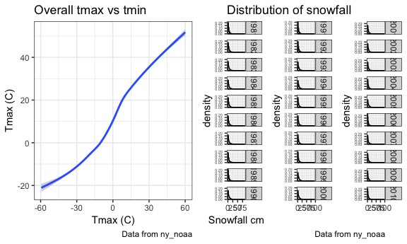

p8105\_hw3\_cz2544
================
Chunxiao Zhai
10/12/2018

Problem 1
=========

**1. Data cleaning** Format the data to use appropriate variable names; Focus on the “Overall Health” topic Include only responses from “Excellent” to “Poor” Organize responses as a factor taking levels ordered from “Excellent” to “Poor”

``` r
brfss_tidy = brfss_smart2010 %>% 
  janitor::clean_names() %>% 
  select(year, locationabbr, locationdesc, topic, response, data_value, geo_location) %>% 
  filter(topic == "Overall Health") %>% 
  rename(prop = data_value) %>% 
  mutate(response = factor(response, levels = c("Excellent","Very good","Good","Fair","Poor" )))
```

**2. Using this dataset, do or answer the following (commenting on the results of each):** **In 2002, which states were observed at 7 locations?**

``` r
brfss_tidy %>% 
  filter(year == 2002) %>% 
  group_by(locationabbr) %>% 
  distinct(geo_location) %>% 
  filter(n() == 7) %>%
  summarise()
```

    ## # A tibble: 3 x 1
    ##   locationabbr
    ##   <chr>       
    ## 1 CT          
    ## 2 FL          
    ## 3 NC

**Comment:** In 2002, there were three states observed at 7 locations: Connecticut, Florida and North Carolina.

**Make a “spaghetti plot” that shows the number of locations in each state from 2002 to 2010.**

``` r
p1 = brfss_tidy %>%
  group_by(locationabbr, year) %>% 
  mutate(n = n_distinct(geo_location)) %>% 
  # in case to check the outstanding state of "FL", unmute the filter
  # filter(year == 2007, n >= 40) %>% 
  ggplot(aes(x = year, y = n, color = locationabbr)) +
  geom_line(alpha = 0.7, size = 1) + 
  labs(
    title = "spaghetti plot of number of locations in each state",
    x = "year 2002-2008",
    y = "number of locations",
    caption = "Data from BRFSS"
  ) + 
  scale_x_continuous(breaks = c(2002,2003,2004,2005,2006,2007,2008),
                     limits = c(2002, 2008)) +
  viridis::scale_color_viridis(option="inferno", name = "States", discrete = TRUE) +
  theme(legend.direction = "horizontal", legend.key.size = unit(0.3, "cm"),
        legend.text = element_text(size = 6),
        legend.title = element_text(size = 6))
p1_s = p1 + guides(col = guide_legend(ncol = 26, nrow = 2, override.aes = list(size = 1.5)))
ggsave("number_of_each_place_spaghetti_plot.pdf", p1_s, dpi = 600)
```

    ## Saving 6 x 3.6 in image

    ## Warning: Removed 2925 rows containing missing values (geom_path).

``` r
p1_s
```

    ## Warning: Removed 2925 rows containing missing values (geom_path).

 **Comment:**The number of locations in each state from 2002 to 2010 is generally stably below 10 for most states, but there are four states showed some increase and showed number between 10 and 20. In 2007, there is one state showed significantly high number over 40 while its average number in all other years is below 10. After rechecking the data found it is Florida. Florida has 67 counties so the number is possible. In a spaghetti with over 50 variables, which color is what is just imposibble to distinguish, only outstanding values would be easier to recognize.

**Make a table showing, for the years 2002, 2006, and 2010, the mean and standard deviation of the proportion of “Excellent” responses across locations in NY State.**

``` r
brfss_tidy %>%
  filter(year %in% c(2002, 2006, 2010), locationabbr == "NY", response == "Excellent") %>% 
  group_by(year) %>% 
  summarise(mean(prop), sd(prop)) %>% 
  knitr::kable(digits = 2)
```

|       year|       mean(prop)|                                                                                                                                                                                                                         sd(prop)|
|----------:|----------------:|--------------------------------------------------------------------------------------------------------------------------------------------------------------------------------------------------------------------------------:|
|       2002|            24.04|                                                                                                                                                                                                                             4.49|
|       2006|            22.53|                                                                                                                                                                                                                             4.00|
|       2010|            22.70|                                                                                                                                                                                                                             3.57|
|  \*\*Comme|  nt:\*\*The mean|  and standard deviation of the proportion of “Excellent” responses across locations in NY State is not very different in year 2002, 2006 and 2010. The year 2002 showed slightly higher mean but also higher standard deviation.|

**For each year and state, compute the average proportion in each response category (taking the average across locations in a state). Make a five-panel plot that shows, for each response category separately, the distribution of these state-level averages over time.**

``` r
p2 = brfss_tidy %>%
  group_by(year, locationabbr, response) %>% 
  mutate(mean = mean(prop)) %>% 
  distinct(year, locationabbr, mean) %>% 
  # in case to check the outstanding state "WV", unmute the filter
  #filter(locationabbr == "WV") %>% 
  distinct(year, locationabbr, mean) %>% 
  ggplot(aes(x = year, y = mean, color = locationabbr)) +
  geom_point(size = 1) +
  geom_line(alpha = 0.3, size = 0.3) +
  labs(
    title = "Distribution of state-level average proportions over time",
    x = "Year 2002-2008",
    y = "Average proportion %",
    caption = "Data from BRFSS"
  ) + 
  scale_x_continuous(breaks = c(2002,2003,2004,2005,2006,2007,2008),
                     limits = c(2002, 2008)) +
  viridis::scale_color_viridis(option="inferno", name = "States", discrete = TRUE) +
  theme(axis.text.x = element_text(angle =  -45,size = 7 ),
        axis.title.x = element_text(size = 9),
        legend.direction = "horizontal", legend.key.size = unit(0.3, "cm"),
        legend.text = element_text(size = 6),
        legend.title = element_text(size = 6))+
  facet_grid(~response) 
p2_s = p2 + guides(col = guide_legend(ncol = 26, nrow = 2, override.aes = list(size = 1.5)))
ggsave("response_proportion_plot.pdf", p2_s, dpi = 600)
```

    ## Saving 6 x 3.6 in image

    ## Warning: Removed 511 rows containing missing values (geom_point).

    ## Warning: Removed 100 rows containing missing values (geom_path).

``` r
p2_s
```

    ## Warning: Removed 511 rows containing missing values (geom_point).

    ## Warning: Removed 100 rows containing missing values (geom_path).

 **Comment:**The diatribution of mean average proportion in each response category is different, with highest mean average proportion in "Very Good", mainly between 30-40%, then "Good", majority falled into 25-35%, then followed by "Ecxellent", fluctuate between 18-28%. The mean propotion of response "Fair" is 7-15%, and 2-6% for those who responsed "Poor", which showed narrower distribution than the "Good" to "Excellent". It is obvious that one state - "WV", in light lime, had lower average proportion of responses across years in the "Excellent", but higher in the "Poor". The "Overall Health" could be lower in this state due to this noticeable difference in the distribution of average proportion of different responses.

Problem 2
=========

``` r
data(instacart)
skimr::skim(instacart)
```

    ## Skim summary statistics
    ##  n obs: 1384617 
    ##  n variables: 15 
    ## 
    ## -- Variable type:character ---------------------------------------------------------------------------------------------------
    ##      variable missing complete       n min max empty n_unique
    ##         aisle       0  1384617 1384617   3  29     0      134
    ##    department       0  1384617 1384617   4  15     0       21
    ##      eval_set       0  1384617 1384617   5   5     0        1
    ##  product_name       0  1384617 1384617   3 159     0    39123
    ## 
    ## -- Variable type:integer -----------------------------------------------------------------------------------------------------
    ##                variable missing complete       n       mean        sd p0
    ##       add_to_cart_order       0  1384617 1384617       8.76      7.42  1
    ##                aisle_id       0  1384617 1384617      71.3      38.1   1
    ##  days_since_prior_order       0  1384617 1384617      17.07     10.43  0
    ##           department_id       0  1384617 1384617       9.84      6.29  1
    ##               order_dow       0  1384617 1384617       2.7       2.17  0
    ##       order_hour_of_day       0  1384617 1384617      13.58      4.24  0
    ##                order_id       0  1384617 1384617 1706297.62 989732.65  1
    ##            order_number       0  1384617 1384617      17.09     16.61  4
    ##              product_id       0  1384617 1384617   25556.24  14121.27  1
    ##               reordered       0  1384617 1384617       0.6       0.49  0
    ##                 user_id       0  1384617 1384617   1e+05     59487.15  1
    ##     p25     p50     p75    p100
    ##       3       7      12      80
    ##      31      83     107     134
    ##       7      15      30      30
    ##       4       8      16      21
    ##       1       3       5       6
    ##      10      14      17      23
    ##  843370 1701880 2568023 3421070
    ##       6      11      21     100
    ##   13380   25298   37940   49688
    ##       0       1       1       1
    ##   51732   1e+05  154959  206209
    ##                                              hist
    ##  <U+2587><U+2583><U+2581><U+2581><U+2581><U+2581><U+2581><U+2581>
    ##  <U+2583><U+2587><U+2583><U+2583><U+2587><U+2585><U+2585><U+2586>
    ##  <U+2582><U+2585><U+2583><U+2583><U+2581><U+2582><U+2581><U+2587>
    ##  <U+2583><U+2587><U+2582><U+2581><U+2582><U+2586><U+2581><U+2583>
    ##  <U+2587><U+2585><U+2583><U+2583><U+2581><U+2583><U+2585><U+2585>
    ##  <U+2581><U+2581><U+2583><U+2587><U+2587><U+2587><U+2585><U+2582>
    ##  <U+2587><U+2587><U+2587><U+2587><U+2587><U+2587><U+2587><U+2587>
    ##  <U+2587><U+2582><U+2581><U+2581><U+2581><U+2581><U+2581><U+2581>
    ##  <U+2586><U+2586><U+2587><U+2587><U+2587><U+2586><U+2587><U+2587>
    ##  <U+2586><U+2581><U+2581><U+2581><U+2581><U+2581><U+2581><U+2587>
    ##  <U+2587><U+2587><U+2587><U+2587><U+2587><U+2587><U+2587><U+2587>

**1. Exploration of dataset**. Write a short description of the dataset, noting the size and structure of the data, describing some key variables, and giving illstrative examples of observations. Then, do or answer the following (commenting on the results of each):

**Description**The dataset has 15 variables and 1384617 observations without missing values. The names have been cleaned with character variables of aisle, department, eval\_set and product\_name, integer variables of add\_to\_cart\_order, aisle\_id, days\_since\_prior\_order, department\_id, order\_dow, order\_hour\_of\_day, order\_id, order\_number, product\_id, reordered and user\_id. The variables can be put into 6 classes: 1.id to track a order/orderer (order, user)(id), 2. catergories and identification of a product (department, aisle, product)(name, id), 3. order time/location distribution (order\_hour\_of\_day, order\_dow, eval\_set), 4. frequency of order (reorder, days\_since\_prior\_order), 5. other character of user behavior (add\_to\_cart\_order). And two variables I don not know what exactly meaning yet is (order\_number).

It seems to be a dataset about shopping records of 131209 users and their 131209 orders, thus each user had made only one order during the dataset study period. There is a total 39123 kinds of products, in 21 departments and 134 aisles. Products, aisles, and departments were recored with both name(character) and ID(integer). Through 0 to 23, orders are most often made at14, mostly between10, 17. Throuhgh day 0 to 6 in a week, orders are most often made at3, mostly between1, 5. Train is the only location in eval\_set. The average reorder rate is NA, with average days since prior order of 17.0661259+/-10.4264178, the median is 15, range between 0, 30. The mean number of add\_to\_cart\_order is 8.7580443+/-7.4239365, and the median is 7, range between 1, 80. The mean number of order\_number is 17.0914101+/-16.6140365, and median is 11, range between 4, 100.

``` r
instacart %>% 
  group_by(product_name) %>% 
  filter(n() > 10000) %>% 
  summarise(n = n(), mean(reordered), mean(days_since_prior_order)) %>% 
  knitr::kable(digits = 2)
```

| product\_name          |      n|  mean(reordered)|  mean(days\_since\_prior\_order)|
|:-----------------------|------:|----------------:|--------------------------------:|
| Bag of Organic Bananas |  15480|             0.86|                            15.74|
| Banana                 |  18726|             0.88|                            16.71|
| Organic Strawberries   |  10894|             0.79|                            15.45|

``` r
instacart %>% 
  group_by(product_name) %>% 
  filter(n() %in% c(8000:10000) ) %>% 
  summarise(n = n(), mean(reordered), mean(days_since_prior_order)) %>% 
  knitr::kable(digits = 2)
```

| product\_name           |        n|   mean(reordered)|                                                                                                                                                                                                                                                                                                                                                          mean(days\_since\_prior\_order)|
|:------------------------|--------:|-----------------:|----------------------------------------------------------------------------------------------------------------------------------------------------------------------------------------------------------------------------------------------------------------------------------------------------------------------------------------------------------------------------------------:|
| Large Lemon             |     8135|              0.73|                                                                                                                                                                                                                                                                                                                                                                                    17.58|
| Organic Baby Spinach    |     9784|              0.82|                                                                                                                                                                                                                                                                                                                                                                                    17.12|
| The top 3 popular produ |  cts are|  : Banana, Bag of|  Organic Bananas, and Organic Strawberries, all sold over 10000, with mean reorder rate of 0.88, 0.86, 0.79 and mean days since prior order for these products are 16.71, 15.74 and 15.45. The 4th and 5th most popular products are Large Lemon and Organic Baby Spinach, bought 9784 and 8135 times with mean reorder rate of 0.82, 0.73 and mean days since prior order 17.12, 17.58.|

The following is a plot showing how products of different departments is distributed in different reorder rate and number of purchases. It may crash R so it won't run during the knitting.

``` r
p3 = instacart %>% 
  group_by(department) %>% 
  mutate(n = n(), re = mean(reordered), t = mean(days_since_prior_order)) %>% 
  ggplot(aes(x = n, y = re, color = department)) +
  geom_point(size = 3) +
  scale_x_log10() +
  scale_y_continuous()+
  labs(
    title = "Distribution of popularity and reorder rate by department",
    x = "Number of purchases",
    y = "Reorder rate",
    caption = "Data from instacart"
  ) +
  viridis::scale_color_viridis( name = "department", discrete = TRUE) +
  theme(legend.direction = "horizontal", legend.key.size = unit(0.4, "cm"),
        legend.text = element_text(size = 7.5),
        legend.title = element_text(size = 8))

p3_s = p3 + guides(col = guide_legend(ncol = 11, nrow = 2, override.aes = list(size = 1.5)))
ggsave("explore_popularity_reorder_diatribution_plot.pdf", p3_s, dpi = 300)
p3_s
```

**2. Questions** **How many aisles** are there, and which aisles are the most items ordered from?

``` r
instacart %>% 
  group_by(aisle) %>% 
  summarise(n= n()) %>%
  arrange(desc(n)) %>% 
  filter(row_number() <= 10) %>% 
  knitr::kable(digits = 2)
```

| aisle                            |                                                                                                                                                                                                    n|
|:---------------------------------|----------------------------------------------------------------------------------------------------------------------------------------------------------------------------------------------------:|
| fresh vegetables                 |                                                                                                                                                                                               150609|
| fresh fruits                     |                                                                                                                                                                                               150473|
| packaged vegetables fruits       |                                                                                                                                                                                                78493|
| yogurt                           |                                                                                                                                                                                                55240|
| packaged cheese                  |                                                                                                                                                                                                41699|
| water seltzer sparkling water    |                                                                                                                                                                                                36617|
| milk                             |                                                                                                                                                                                                32644|
| chips pretzels                   |                                                                                                                                                                                                31269|
| soy lactosefree                  |                                                                                                                                                                                                26240|
| bread                            |                                                                                                                                                                                                23635|
| **Comment:** There are 134 aisle |  s, most items are ordered from fresh vegetables, fresh fruits, packaged vegetables fruits, yogurt, packaged cheese, water seltzer sparkling water, milk, chips pretzels, soy lactosefree and bread.|

**Make a plot** that shows the number of items ordered in each aisle. Order aisles sensibly, and organize your plot so others can read it.

``` r
aisle_rank =
  instacart %>% 
  group_by(aisle) %>% 
  summarise(n = n()) %>% 
  arrange((n)) %>%
  mutate(rank = row_number(), aisle_r = factor(aisle, levels = c(aisle))) 

p4 = aisle_rank %>% 
  ggplot(aes(x = rank, y = n, color = aisle_r)) +
  geom_point(size = 1.5) +
  scale_y_continuous(trans ='log10') +
  scale_x_discrete() +
  labs(
    title = "Number of items ordered by aisle",
    y = "Aisle",
    x = "Number of items",
    caption = "Data from instacart"
  ) +
  viridis::scale_color_viridis( name = "aisle_r", discrete = TRUE) +
  theme(legend.direction = "horizontal", 
        legend.key.size = unit(1, "mm"), legend.spacing = unit(-0.2, "mm"),
        plot.title = element_text(size = 6), plot.caption = element_text(size = 6),
        axis.title.x = element_text(size = 6), axis.title.y = element_text(size = 5),
        axis.text.y = element_text(size = 4))

p4_s = p4 + guides(col = guide_legend(ncol = 134, nrow = 1,
                                      label.position = "bottom", label.hjust = 0,
                                      label.vjust = 0,title.vjust = -0.5,
                                      label.theme = element_text(angle = -90, size = 3),
                                      title.theme = element_text(angle = -90, size = 0),
                                      lable.position = "bottom",
                                      override.aes = list(legend.position = "bottom", size = 0.48)))
ggsave("aisle_plot.pdf", p4_s, dpi = 600)
```

    ## Saving 6 x 3.6 in image

``` r
p4_s
```

 **Comment:**The range of number of items ordered in each aisle is very big, thus display the number in log transformation might make it easier to read. The size of plot and legend change at different rate while I zoom in and out, ggsave as pdf is a better way to guarantee reproducibility.

**Make a table** showing the most popular item in each of the aisles “baking ingredients”, “dog food care”, and “packaged vegetables fruits”.

``` r
instacart %>% 
  filter(aisle %in% c("baking ingredients", "dog food care", "packaged vegetables fruits")) %>% 
  select(aisle, product_name) %>%  
  group_by(aisle, product_name) %>% 
  summarise(n = n()) %>% 
  ungroup() %>%
  group_by(aisle) %>% 
  filter(n == max(n)) %>% 
  knitr::kable(digits = 2)
```

| aisle                        | product\_name                                    |                                                                                                                                                                                                                                                                                                                                                                                                                                        n|
|:-----------------------------|:-------------------------------------------------|----------------------------------------------------------------------------------------------------------------------------------------------------------------------------------------------------------------------------------------------------------------------------------------------------------------------------------------------------------------------------------------------------------------------------------------:|
| baking ingredients           | Light Brown Sugar                                |                                                                                                                                                                                                                                                                                                                                                                                                                                      499|
| dog food care                | Snack Sticks Chicken & Rice Recipe Dog Treats    |                                                                                                                                                                                                                                                                                                                                                                                                                                       30|
| packaged vegetables fruits   | Organic Baby Spinach                             |                                                                                                                                                                                                                                                                                                                                                                                                                                     9784|
| **Comment:**The most popular | item in baking ingredients is Light Brown Sugar, |  bought 499 times; The most popular item in dog food care is Snack Sticks Chicken & Rice Recipe Dog Treats bought 30 times, and The most popular item in packaged vegetables fruits is Organic Baby Spinach, bought 9784 times. As shown previously, there is huge differences in popularity of total purchases in different aisles, now find out the popularity difference in most popular items in different aisles is not a supprise.|

**Make a table** showing the mean hour of the day at which Pink Lady Apples and Coffee Ice Cream are ordered on each day of the week; format this table for human readers (i.e. produce a 2 x 7 table).

``` r
instacart %>%
  filter(product_name %in% c("Pink Lady Apples","Coffee Ice Cream")) %>% 
  select(product_name, order_dow, order_hour_of_day) %>%  
  group_by(product_name, order_dow) %>% 
  summarise(hour = mean(order_hour_of_day)) %>% 
  spread(key = order_dow, hour) %>% 
  knitr::kable(digits = 2)
```

| product\_name    |      0|      1|      2|      3|      4|      5|      6|
|:-----------------|------:|------:|------:|------:|------:|------:|------:|
| Coffee Ice Cream |  13.77|  14.32|  15.38|  15.32|  15.22|  12.26|  13.83|
| Pink Lady Apples |  13.44|  11.36|  11.70|  14.25|  11.55|  12.78|  11.94|

**Comment:**The mean hour of the day at which Pink Lady Apples and Coffee Ice Cream are ordered on each day of the week are slightly different, Coffee Ice Cream ranged from 12.26 to 15.38 while Pink Lady Apples ranged 11.36 to 13.44. On Sunday and Friday, the mean hour for the two different product showed small difference around 0.5 hour, on Monday, Wednesday and Saturday around 1 hour, while on Tueday and Thurday it was over 3.6 hour. Friday is the only day that mean hour of Pink Lady Apples is larger than that of Coffee Icecream's. Sunday is the day with samllest difference of 0.33 hour and Tuesday is of the largest difference of 3.68.

Problem 3
=========

``` r
data("ny_noaa")
```

The goal is to do some exploration of this dataset. To that end, write a short description of the dataset, noting the size and structure of the data, describing some key variables, and indicating the extent to which missing data is an issue. **1. Exploration of dataset**.

``` r
ny_noaa %>% 
  skimr::skim()
```

    ## Skim summary statistics
    ##  n obs: 2595176 
    ##  n variables: 7 
    ## 
    ## -- Variable type:Date --------------------------------------------------------------------------------------------------------
    ##  variable missing complete       n        min        max     median
    ##      date       0  2595176 2595176 1981-01-01 2010-12-31 1997-01-21
    ##  n_unique
    ##     10957
    ## 
    ## -- Variable type:character ---------------------------------------------------------------------------------------------------
    ##  variable missing complete       n min max empty n_unique
    ##        id       0  2595176 2595176  11  11     0      747
    ##      tmax 1134358  1460818 2595176   1   4     0      532
    ##      tmin 1134420  1460756 2595176   1   4     0      548
    ## 
    ## -- Variable type:integer -----------------------------------------------------------------------------------------------------
    ##  variable missing complete       n  mean     sd  p0 p25 p50 p75  p100
    ##      prcp  145838  2449338 2595176 29.82  78.18   0   0   0  23 22860
    ##      snow  381221  2213955 2595176  4.99  27.22 -13   0   0   0 10160
    ##      snwd  591786  2003390 2595176 37.31 113.54   0   0   0   0  9195
    ##                                              hist
    ##  <U+2587><U+2581><U+2581><U+2581><U+2581><U+2581><U+2581><U+2581>
    ##  <U+2587><U+2581><U+2581><U+2581><U+2581><U+2581><U+2581><U+2581>
    ##  <U+2587><U+2581><U+2581><U+2581><U+2581><U+2581><U+2581><U+2581>

**Description**: There are 7 variables with 2595176 statistics in this dataset. The variables are of three type: One date variable range from 1981-01-01 to 1997-01-21, total 10957 days. Three characters variables id, tmax and tmin, there is 747 unique ids, 43.7% of tmax(1134358/2595176) and tmin(1134420/2595176) values are missing. There is three integer variables prcp, snow and snwd, all with high percentage of missing values, namely 5.65% = (145838/2595176) for prcp, 14.69% = (381221/2595176) for snow and 22.80% = (591786/2595176) for snwd. All three distribution of data are very skewed. The outliers are very large accompanied by over half in prcp or over 75% in snow and snwd of the values equals 0.

**2. Questions** **data cleaning**. Create separate variables for year, month, and day. Ensure observations for temperature, precipitation, and snowfall are given in reasonable units.

``` r
ny_noaa1 = ny_noaa %>% 
  separate("date", c("year", "month", "day"), sep = "-") %>% 
  mutate(prcp_mm = prcp/10, snow_cm = snow/10, snwd_cm = snwd/10, 
         tmax_c = as.numeric(tmax)/10, tmin_c = as.numeric(tmin)/10) %>% 
  select(id, year:day, prcp_mm:tmin_c)
```

**Comment:** According to <https://www1.ncdc.noaa.gov/pub/data/ghcn/daily/readme.txt>, the five core elements are: PRCP = Precipitation (tenths of mm) SNOW = Snowfall (mm) SNWD = Snow depth (mm) TMAX = Maximum temperature (tenths of degrees C) TMIN = Minimum temperature (tenths of degrees C)

While by <https://en.wikipedia.org/wiki/Climate_of_New_York>, the measurement units are: Greatest 24-hour precipitation: 13.57 inches or 34.5 cm or 345 mm Greatest 24-hour snowfall : 49 inches or 120 cm Greatest Snow Depth: 119 inches or 300 cm Highest temperature: 108 °F or 42.2 °C Lowest temperature: −52 °F or −46.7 °C

I decided to change the units to the wikipedia format.

**For snowfall, what are the most commonly observed values? Why?**

``` r
ny_noaa1 %>% 
  group_by(snow_cm) %>% 
  summarise(n = n()) %>% 
  arrange(desc(n)) %>% 
  head() %>% 
  knitr::kable() 
```

|      snow\_cm|                                                                                                                                                                                                                                                                           n|
|-------------:|---------------------------------------------------------------------------------------------------------------------------------------------------------------------------------------------------------------------------------------------------------------------------:|
|           0.0|                                                                                                                                                                                                                                                                     2008508|
|            NA|                                                                                                                                                                                                                                                                      381221|
|           2.5|                                                                                                                                                                                                                                                                       31022|
|           1.3|                                                                                                                                                                                                                                                                       23095|
|           5.1|                                                                                                                                                                                                                                                                       18274|
|           7.6|                                                                                                                                                                                                                                                                       10173|
|  \*\*Comment:|  \*\* The most common observed values for snowfall are 0 (2008508 observations), NA (381221 observations), and followed by 2.5cm, 1.3cm, 5.1cm and 7.6cm. For the climate of New York state is generally humid continental, and there is no snow in majority of the months.|

**Make a two-panel plot** showing the average max temperature in January and in July in each station across years. Is there any observable / interpretable structure? Any outliers?

``` r
p5 = ny_noaa1 %>% 
  filter(month %in% c("01", "07")) %>% 
  group_by(id, month) %>% 
  summarise(mean_tmax = mean(tmax_c, na.rm = TRUE), cmplt_rate = 1 - sum(is.na(tmax_c))/n()) %>% 
  arrange(mean_tmax) %>% 
  ggplot(aes(x = cmplt_rate, y = mean_tmax, color = id, alpha = cmplt_rate, legend = FALSE)) +
         geom_point(size = 1) +
  labs(
    title = "Average max temperature in January and in July",
    y = "Max temperature C",
    x = "Data complete rate",
    caption = "Data from ny_noaa"
  ) +
  facet_grid(~ month) +
    viridis::scale_color_viridis(option = "magma", name = "id", discrete = TRUE) +
  theme(legend.position="none") 
ggsave("tmax_in_jan_jul.pdf", p5, dpi = 300)
```

    ## Saving 6 x 3.6 in image

    ## Warning: Removed 876 rows containing missing values (geom_point).

``` r
p5
```

    ## Warning: Removed 876 rows containing missing values (geom_point).

 **Comment:** There is only 150 complete records, while the rest contains different amount of NAs. I plotted the average max temperature in January and in July and the distribution of defferent percentage of NAs. In January, the average max temperature is between -6°C and 6°C for most stations, there are three outliers fell below the range, namely with about 99%, 30% and 10% NAs. In July, the average max temperature is around 23°C to 32°C, no significant outlier has been ovserved.

**Make a two-panel plot** showing: (i) tmax vs tmin for the full dataset (note that a scatterplot may not be the best option); (ii) make a plot showing the distribution of snowfall values greater than 0 and less than 100 separately by year.

``` r
p6 = ny_noaa1 %>% 
  select(id, year, tmax_c, tmin_c) %>% 
  ggplot(aes(x = tmin_c, y = tmax_c)) +
  geom_smooth(se = TRUE)+
  labs(
    title = "Overall tmax vs tmin",
    y = "°C",
    x = "°C",
    caption = "Data from ny_noaa"
  ) 

p7_1 = ny_noaa1 %>%
  mutate(year = as.numeric(year)) %>% 
  filter(snow_cm >0, snow_cm <100, year >=1981, year<=1990 ) %>%
  select(year, month, snow_cm) %>% 
  ggplot(aes(x = snow_cm, color = "navy")) +
  geom_density() +
  labs(
    title = "Distribution of snowfall",
    x = "Snowfall cm"
  ) +
  facet_grid(rows = vars(year)) +
  theme(axis.text.y = element_text(size = 4))
  
p7_2 =  ny_noaa1 %>%
  mutate(year = as.numeric(year)) %>% 
  filter(snow_cm >0, snow_cm <100, year >=1991, year<=2000 ) %>%
  select(year, month, snow_cm) %>% 
  ggplot(aes(x = snow_cm, color = "navy")) +
  geom_density() + 
  labs(x = NULL) +
  facet_grid(rows = vars(year)) +
  theme(axis.text.y = element_text(size = 4)) 

p7_3 =  ny_noaa1 %>%
  mutate(year = as.numeric(year)) %>% 
  filter(snow_cm >0, snow_cm <100, year >=2001, year<=2010 ) %>%
  select(year, month, snow_cm) %>% 
  ggplot(aes(x = snow_cm, color = "navy")) +
  geom_density() +
  labs( x = NULL,
        caption = "Data from ny_noaa") +
  facet_grid(rows = vars(year)) +
  theme(axis.text.y = element_text(size = 4))  
  
p8 = (p6 + (p7_1 + p7_2 + p7_3)) 
ggsave("tmax_tmin_snow_plot.pdf", p8, dpi = 300)
```

    ## Saving 6 x 3.6 in image

    ## `geom_smooth()` using method = 'gam' and formula 'y ~ s(x, bs = "cs")'

    ## Warning: Removed 1136276 rows containing non-finite values (stat_smooth).

``` r
p8
```

    ## `geom_smooth()` using method = 'gam' and formula 'y ~ s(x, bs = "cs")'

    ## Warning: Removed 1136276 rows containing non-finite values (stat_smooth).


